## PCA推导

### [Robust principal component analysis](http://www.researchgate.net/publication/3878667_Robust_principal_component_analysis?ev=auth_pub)

​    以下面这幅图开始我们的推导：

上面是二维空间中的一组数据，很明显，数据的分布让我们很容易就能看出来主成分的轴（简称主轴）的大致方向。下面的问题就是如何通过数学计算找出主轴的方向。来看这张图：

现在要做的事情就是寻找u1的方向，对于这点，我想好多人都有经验，这不就是以前用最小二乘法拟合数据时做的事情吗！对，最小二乘法求出来的直线（二维）的方向就是u1的方向！那u2的方向呢？因为这里是二维情况，所以u2方向就是跟u1垂直的方向，对于高维数据，怎么知道u2的方向？经过下面的理论推导，各个主轴都能确定下来。

​    给定一组数据：（如无说明，以下推导中出现的向量都是**默认是列向量**）

​												{z1 ,z2 ,z3 ...zn}

​    将其中心化后表示为：      

​                                       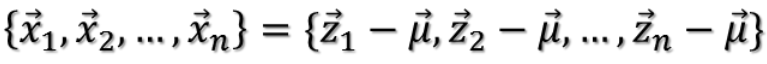

中心化后的数据在第一主轴u1方向上分布散的最开，也就是说**在u1方向上的投影的绝对值之和最大**（也可以说方差最大），计算投影的方法就是将x与u1做内积，由于只需要求u1的方向，所以设u1是单位向量。

也就是最大化下式：

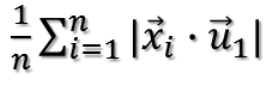

也即最大化：

​                                                    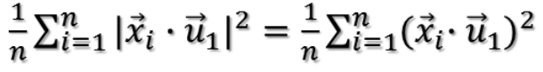

解释：平方可以把绝对值符号拿掉，光滑曲线处理起来方便。

两个向量做内积可以转化成矩阵乘法：

​                                                                  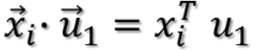

所以目标函数可以表示为：

​                                                     

括号里面就是矩阵乘法表示内积，转置以后的行向量乘以列向量得到一个数。因为一个数的转置还是其本身，所以又可以将目标函数化为：

​                                              

这样就可以把括号去掉！去掉以后变成：

​                                                  

由于u1和i无关，可以把它拿到求和符外面：

​                                                            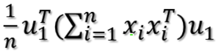

注意，其实括号里面是一个矩阵乘以自身的转置，这个矩阵形式如下：

​                                                            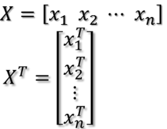

X矩阵的第i列就是xi，于是有：

​                                                        

所以目标函数最后化为：

​                                                                    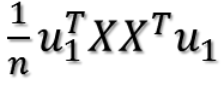

## 证明存在最大值

上式到底有没有最大值呢？如果没有前面的1/n，那就是就是一个标准的二次型！并且XX'(为了方便，用'表示转置)得到的矩阵是一个半正定的对称阵！为什么？首先XX'是对称阵，因为(XX')'=XX'，下面证明它是半正定，什么是半正定？就是所有特征值大于等于0。

假设XX'的某一个特征值为，对应的特征向量为，则有：

​                                                                             

​                                                                 

​                                                                

​                      

​                                                      

证明完毕！**对于半正定阵的二次型，存在最大值！**现在问题就是如何求目标函数的最大值？以及取最大值时u1的方向？下面介绍两种方法。

## 方法一  拉格朗日乘数法

目标函数和约束条件构成了一个最大化问题：            u1位单位向量；最大化投影之和——求u1

​                                                            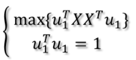

构造拉格朗日函数：

​                                                       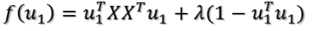

对u1求导

​                                                  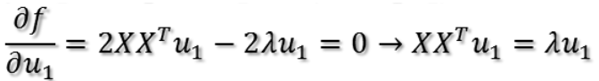

显然，**u1即为XX'特征值λ对应的特征向量**！XX'的所有特征值和特征向量都满足上式，那么将上式代入目标函数表达式即可得到

​                                                         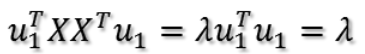

**所以，如果取最大的那个特征值，那么得到的目标值就最大**。有可能你会有疑问，为什么一阶导数为0就是极大值呢？那么再求二阶导数：

​                        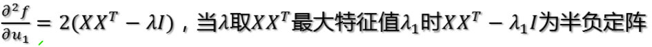

**二阶导数半负定，所以，目标函数在最大特征值所对应的特征向量上取得最大值！**所以，第一主轴方向即为第一大特征值对应的特征向量方向。第二主轴方向为第二大特征值对应的特征向量方向，以此类推，证明类似。

## 方法二  奇异值法

这方法是从矩阵分析里面总结的，随便取个名叫奇异值法。

首先，对于向量x，其二范数（也就是模长）的平方为：

​                                   

所以有：

​        

把二次型化成一个范数的形式，最大化上式也即这个问题：对于一个矩阵，它对一个向量做变换，变换前后的向量的模长伸缩尺度如何才能最大？这个很有趣，简直就是把矩阵的真面目给暴露出来了。为了给出解答，下面引入矩阵分析中的一个定理：

​                                                      

表示矩阵A的最大奇异值！一个矩阵A的奇异值为AA'(或A'A)的特征值开平方，前面讲过AA'的特征值都大于等于0。当x为单位向量时，上式就是我们的目标函数表达式。然而，上式只是告诉我们能取到最大值是多少，并没有说取到最大值时x的方向，要想知道取到最大值时的方向，那就来证明这个定理吧！

考察对称阵

​                                                                   

设

​                                                    

为其n个特征值，并令与之对应的单位特征向量为：

​                                                                 

对了，忘了提醒，对称阵不同特征值对应的特征向量两两正交！这组特征向量构成了空间中的一组单位正交基。

任意取一个向量x，将其表示为

​                                                         

则

​                              

​           

将代入上式可得

​     

由于这些单位特征向量两两正交，只有相同的做内积为1，不同的做内积为0.所以上式做内积出来的结果为：

​     

根据特征值的大小关系有

​                        

所以

​                                                   

定理得证！

显然，当时取得最大值

​                          

​                                            

再回到我们的问题，需要最大化：

​                                          

将X'代入上面证明过程中的矩阵A，则u1的方向即为A'A=(X')'X'=XX'对大特征值对应的特征向量的方向！

所以第一主轴已经找到，第二主轴为次大特征值对应的特征向量的方向，以此类推。

## 主成分保留占比

两种方法殊途同归，现在来解答关于主成分保留占比的问题。上面我们知道第一主轴对应的最大值是最大奇异值（也就是AA'最大特征值开平方），第二主轴对应的最大值是次大奇异值，以此类推。那么假设取前r大奇异值对应的主轴作为提取的主成分，则提取后的数据信息占比为：

​                                                             

分子是前r大奇异值的平方和，分母是所有奇异值的平方和。
